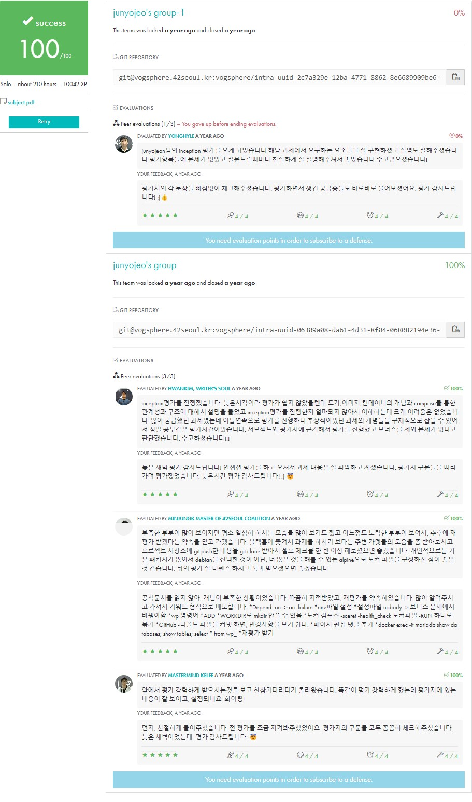
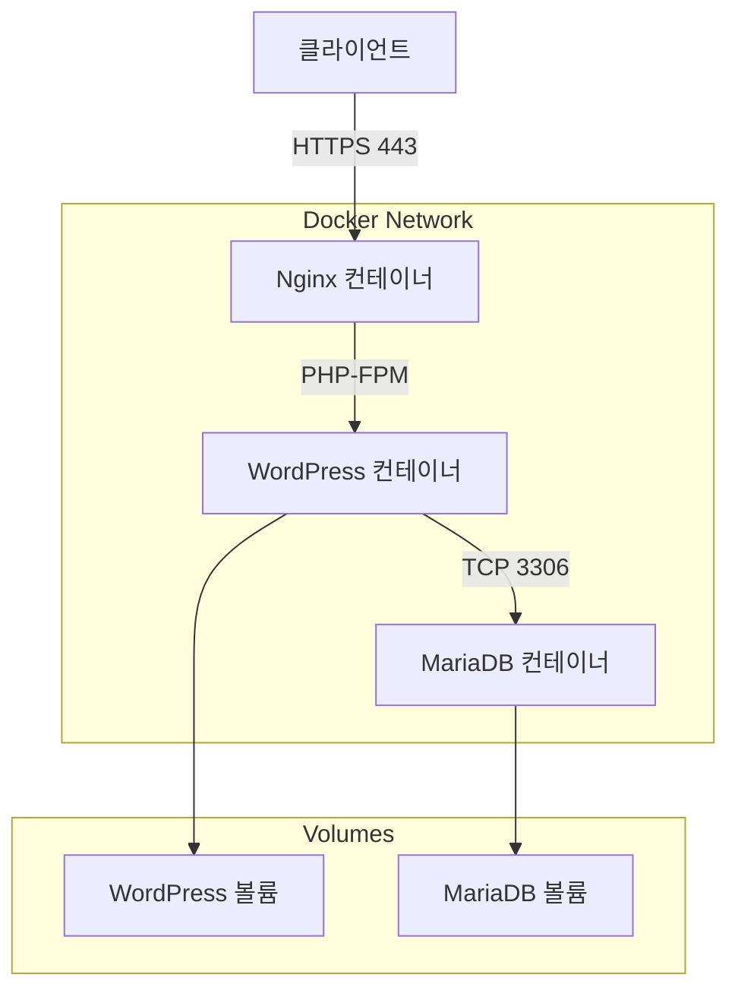
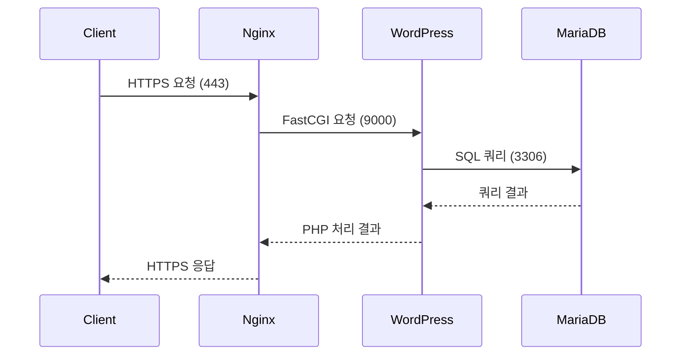

<div align="center">
  <h1>🐳 Inception</h1>
  <p>Docker | Docker Compose | LEMP 스택 구축</p>

  
  
  <div>
    
    
    
    
    
    
    
  </div>

  ### 주요 기능
  - Nginx, MariaDB, WordPress 컨테이너화
  - Docker Compose를 통한 서비스 관리
  - TLS/SSL 보안 설정
  - 데이터 영속성을 위한 볼륨 관리
  - 컨테이너 간 네트워크 구성

  ### 사용 기술
  - Docker & Docker Compose
  - Nginx 웹 서버
  - MariaDB 데이터베이스
  - WordPress CMS
  - Alpine Linux
</div>

## 🚀 Quick Start
```bash
# 1. 저장소 클론
git clone https://github.com/username/Inception.git && cd Inception

# 2. 환경 변수 설정
cp srcs/.env.example srcs/.env
vi srcs/.env

# 3. 서비스 실행
make
```

## 📋 목차
1. [개요](#-개요)
2. [아키텍처](#-아키텍처)
3. [프로젝트 구현 흐름](#-프로젝트-구현-흐름)
4. [설치 방법](#-설치-방법)
5. [서비스 구성](#-서비스-구성)
6. [네트워크 구성](#-네트워크-구성)
7. [볼륨 관리](#-볼륨-관리)
8. [문제 해결](#-문제-해결)
9. [참고 문서](#-참고-문서)

## 🎯 개요
> Docker를 활용한 LEMP(Linux, Nginx, MariaDB, PHP) 스택 구축 프로젝트입니다.

### 프로젝트 구조
```
📦 Inception
 ├── 📜 Makefile
 ├── 📜 docker-compose.yml
 ├── 📂 srcs/
 │   ├── 📜 .env
 │   └── 📂 requirements/
 │       ├── 📂 nginx/
 │       │   ├── 📜 Dockerfile
 │       │   └── 📜 conf/
 │       ├── 📂 mariadb/
 │       │   ├── 📜 Dockerfile
 │       │   └── 📜 conf/
 │       └── 📂 wordpress/
 │           ├── 📜 Dockerfile
 │           └── 📜 conf/
 └── 📂 volumes/
     ├── 📂 wordpress/
     │   ├── 📜 index.php
     │   └── 📜 wp-config.php
     └── 📂 mariadb/
        ├── 📜 my.cnf
        └── 📜 init_db.sh
```

### Key Features
- 모든 서비스는 전용 컨테이너에서 실행
- Alpine Linux 또는 Debian buster 기반 이미지 사용
- 각 서비스별 Dockerfile 직접 작성
- docker-compose를 통한 빌드 자동화
- TLSv1.2 또는 TLSv1.3 보안 설정

## 🏗 아키텍처
> 전체 시스템의 구조와 컨테이너 간 통신을 설명합니다.

### 시스템 구조도


### 컨테이너 구성
1. **Nginx 컨테이너**
   - 리버스 프록시 역할
   - SSL/TLS 종단점
   - WordPress로 PHP 요청 전달

2. **WordPress 컨테이너**
   - PHP-FPM 프로세스 실행
   - WordPress 코어 파일 호스팅
   - MariaDB와 통신

3. **MariaDB 컨테이너**
   - 데이터베이스 서버
   - 데이터 영속성 보장
   - WordPress 데이터 저장

### 네트워크 구성
```yaml
networks:
  inception:
    driver: bridge
    ipam:
      config:
        - subnet: 172.20.0.0/16
```

### 볼륨 마운트
```yaml
volumes:
  wordpress:
    driver: local
    driver_opts:
      type: none
      device: /home/username/data/wordpress
      o: bind
  
  mariadb:
    driver: local
    driver_opts:
      type: none
      device: /home/username/data/mariadb
      o: bind
```

## 📝 프로젝트 구현 흐름

### 1. 기본 구조 생성
```bash
# 1. 프로젝트 디렉토리 구조 생성
mkdir -p inception/srcs/requirements/{nginx,wordpress,mariadb}/{conf,tools}

# 2. docker-compose.yml 위치
inception/srcs/docker-compose.yml

# 3. .env 파일 위치
inception/srcs/.env
```

### 2. Nginx 설정
```bash
# 1. Nginx 기본 설정 가져오기
docker run --name temp-nginx nginx:alpine
docker cp temp-nginx:/etc/nginx/nginx.conf srcs/requirements/nginx/conf/
docker cp temp-nginx:/etc/nginx/conf.d/default.conf srcs/requirements/nginx/conf/
docker rm temp-nginx

# 2. 설정 파일 수정
# - SSL 설정 추가
# - WordPress FastCGI 설정 추가
# - 포트 설정 (443)
vi srcs/requirements/nginx/conf/default.conf
```

### 3. MariaDB 설정
```bash
# 1. MariaDB 기본 설정 가져오기
docker run --name temp-mariadb mariadb:10.5
docker cp temp-mariadb:/etc/mysql/my.cnf srcs/requirements/mariadb/conf/
docker rm temp-mariadb

# 2. 데이터베이스 초기화 스크립트 작성
vi srcs/requirements/mariadb/tools/init_db.sh
```

### 4. WordPress 설정
```bash
# 1. WordPress 다운로드 및 설정
curl -O https://raw.githubusercontent.com/wp-cli/builds/gh-pages/phar/wp-cli.phar
chmod +x wp-cli.phar
sudo mv wp-cli.phar /usr/local/bin/wp

# 2. wp-config.php 템플릿 가져오기
wp core download --path=/tmp/wordpress
cp /tmp/wordpress/wp-config-sample.php srcs/requirements/wordpress/tools/wp-config.php

# 3. PHP-FPM 설정 가져오기
docker run --name temp-php php:fpm-alpine
docker cp temp-php:/usr/local/etc/php-fpm.d/www.conf srcs/requirements/wordpress/conf/
docker rm temp-php
```

### 5. 환경 변수 설정
```bash
# .env 파일 생성
cat << EOF > srcs/requirements/mariadb/.env
MYSQL_ROOT_PASSWORD=your_root_password
MYSQL_DATABASE=wordpress
MYSQL_USER=wordpress
MYSQL_PASSWORD=wordpress_password
EOF
```

## 🚀 설치 방법
> 프로젝트 설치와 실행을 위한 단계별 가이드입니다.

### 1. 사전 요구사항
```bash
# Docker 설치
sudo apt-get update
sudo apt-get install docker.io

# Docker Compose 설치
sudo curl -L "https://github.com/docker/compose/releases/download/v2.0.0/docker-compose-$(uname -s)-$(uname -m)" -o /usr/local/bin/docker-compose
sudo chmod +x /usr/local/bin/docker-compose

# 도커 그룹에 사용자 추가
sudo usermod -aG docker $USER
newgrp docker
```

### 2. 프로젝트 클론
```bash
# 저장소 클론
git clone https://github.com/username/Inception.git
cd Inception

# 환경 변수 설정
cp srcs/.env.example srcs/.env
vi srcs/.env

# .env 파일 예시
DOMAIN_NAME=login.42.fr
MYSQL_ROOT_PASSWORD=your_root_password
MYSQL_USER=wordpress
MYSQL_PASSWORD=wordpress_password
```

### 3. SSL 인증서 생성
```bash
# 자체 서명 인증서 생성
cd srcs/requirements/nginx/conf
openssl req -x509 -nodes -days 365 -newkey rsa:2048 \
    -keyout nginx.key -out nginx.crt \
    -subj "/C=KR/ST=Seoul/L=Seoul/O=42Seoul/OU=Cadet/CN=login.42.fr"
```

### 4. 볼륨 디렉토리 생성
```bash
# WordPress 볼륨
mkdir -p /home/username/data/wordpress
chmod 777 /home/username/data/wordpress

# MariaDB 볼륨
mkdir -p /home/username/data/mariadb
chmod 777 /home/username/data/mariadb
```

### 5. 호스트 파일 설정
```bash
# /etc/hosts 파일에 도메인 추가
sudo echo "127.0.0.1 login.42.fr" >> /etc/hosts
```

### 6. 빌드 및 실행
```bash
# Makefile 사용
make          # 전체 서비스 빌드 및 실행
make build    # 이미지만 빌드
make up       # 컨테이너 실행
make down     # 컨테이너 중지
make clean    # 컨테이너, 이미지, 볼륨 삭제
make fclean   # 전체 클린 (볼륨 데이터 포함)
make re       # 전체 재빌드

# 또는 Docker Compose 직접 사용
docker-compose -f srcs/docker-compose.yml up --build -d
```

### 7. 서비스 확인
```bash
# 컨테이너 상태 확인
docker ps

# 로그 확인
docker-compose -f srcs/docker-compose.yml logs -f

# 서비스 접속
https://login.42.fr     # WordPress 사이트
https://login.42.fr/wp-admin  # 관리자 페이지
```

## 🔧 서비스 구성
> 각 서비스별 설정과 구성 방법을 설명합니다.

### 1. Nginx 설정
```dockerfile
# srcs/requirements/nginx/Dockerfile
FROM alpine:3.19

RUN apk update && apk add --no-cache nginx openssl

COPY conf/nginx.conf /etc/nginx/nginx.conf
COPY conf/default.conf /etc/nginx/http.d/default.conf
COPY conf/nginx.crt /etc/nginx/ssl/nginx.crt
COPY conf/nginx.key /etc/nginx/ssl/nginx.key

EXPOSE 443

CMD ["nginx", "-g", "daemon off;"]
```

```nginx
# srcs/requirements/nginx/conf/default.conf
server {
    listen 443 ssl;
    listen [::]:443 ssl;
    
    server_name login.42.fr;
    
    ssl_certificate /etc/nginx/ssl/nginx.crt;
    ssl_certificate_key /etc/nginx/ssl/nginx.key;
    ssl_protocols TLSv1.2 TLSv1.3;
    
    root /var/www/html;
    index index.php;
    
    location / {
        try_files $uri $uri/ /index.php?$args;
    }
    
    location ~ \.php$ {
        fastcgi_split_path_info ^(.+\.php)(/.+)$;
        fastcgi_pass wordpress:9000;
        fastcgi_index index.php;
        include fastcgi_params;
        fastcgi_param SCRIPT_FILENAME $document_root$fastcgi_script_name;
        fastcgi_param PATH_INFO $fastcgi_path_info;
    }
}
```

### 2. MariaDB 설정
```dockerfile
# srcs/requirements/mariadb/Dockerfile
FROM alpine:3.19

RUN apk update && apk add --no-cache mariadb mariadb-client

COPY conf/my.cnf /etc/my.cnf
COPY tools/init_db.sh /docker-entrypoint-initdb.d/

RUN chmod +x /docker-entrypoint-initdb.d/init_db.sh

EXPOSE 3306

CMD ["mysqld", "--user=mysql"]
```

```bash
# srcs/requirements/mariadb/tools/init_db.sh
#!/bin/sh

if [ ! -d "/var/lib/mysql/mysql" ]; then
    mysql_install_db --user=mysql --datadir=/var/lib/mysql

    mysqld --user=mysql --bootstrap << EOF
USE mysql;
FLUSH PRIVILEGES;
CREATE DATABASE IF NOT EXISTS ${MYSQL_DATABASE};
CREATE USER '${MYSQL_USER}'@'%' IDENTIFIED BY '${MYSQL_PASSWORD}';
GRANT ALL PRIVILEGES ON ${MYSQL_DATABASE}.* TO '${MYSQL_USER}'@'%';
ALTER USER 'root'@'localhost' IDENTIFIED BY '${MYSQL_ROOT_PASSWORD}';
FLUSH PRIVILEGES;
EOF
fi
```

### 3. WordPress 설정
```dockerfile
# srcs/requirements/wordpress/Dockerfile
FROM alpine:3.19

RUN apk update && apk add --no-cache \
    php81 \
    php81-fpm \
    php81-mysqli \
    php81-json \
    php81-curl \
    php81-dom \
    php81-exif \
    php81-fileinfo \

## 🌐 네트워크 구성
> Docker 네트워크 설정과 컨테이너 간 통신 구성을 설명합니다.

### 1. 네트워크 정의
```yaml
# srcs/docker-compose.yml
networks:
  inception:
    name: inception
    driver: bridge
    ipam:
      config:
        - subnet: 172.20.0.0/16
          gateway: 172.20.0.1
```

### 2. 서비스별 네트워크 설정
```yaml
services:
  nginx:
    networks:
      inception:
        aliases:
          - nginx
    ports:
      - "443:443"

  wordpress:
    networks:
      inception:
        aliases:
          - wordpress
    expose:
      - "9000"

  mariadb:
    networks:
      inception:
        aliases:
          - mariadb
    expose:
      - "3306"
```

### 3. 네트워크 보안
```nginx
# Nginx SSL 설정
ssl_protocols TLSv1.2 TLSv1.3;
ssl_prefer_server_ciphers on;
ssl_ciphers ECDHE-ECDSA-AES128-GCM-SHA256:ECDHE-RSA-AES128-GCM-SHA256:ECDHE-ECDSA-AES256-GCM-SHA384:ECDHE-RSA-AES256-GCM-SHA384;
```

### 4. 네트워크 디버깅
```bash
# 네트워크 목록 확인
docker network ls

# 네트워크 상세 정보
docker network inspect inception

# 컨테이너 간 연결 테스트
docker exec -it nginx ping wordpress
docker exec -it nginx ping mariadb

# 포트 리스닝 상태 확인
docker exec -it nginx netstat -tulpn
```

### 5. 트래픽 흐름


### 6. 네트워크 문제 해결
```bash
# 1. DNS 확인
docker exec -it wordpress nslookup mariadb

# 2. 연결 테스트
docker exec -it wordpress nc -zv mariadb 3306

# 3. 로그 확인
docker logs nginx
docker logs wordpress
docker logs mariadb

# 4. 네트워크 재구성
docker-compose down
docker network prune
docker-compose up -d
```

## 💾 볼륨 관리
> 데이터 영속성을 위한 Docker 볼륨 설정과 관리 방법을 설명합니다.

### 1. 볼륨 정의
```yaml
# srcs/docker-compose.yml
volumes:
  wordpress:
    driver: local
    driver_opts:
      type: none
      device: /home/${USER}/data/wordpress
      o: bind
  
  mariadb:
    driver: local
    driver_opts:
      type: none
      device: /home/${USER}/data/mariadb
      o: bind
```

### 2. 볼륨 마운트 설정
```yaml
services:
  wordpress:
    volumes:
      - wordpress:/var/www/html
    
  mariadb:
    volumes:
      - mariadb:/var/lib/mysql
```

### 3. 볼륨 초기화 스크립트
```bash
#!/bin/bash
# srcs/tools/init_volumes.sh

# WordPress 볼륨 초기화
init_wordpress_volume() {
    WORDPRESS_PATH="/home/${USER}/data/wordpress"
    
    if [ ! -d "$WORDPRESS_PATH" ]; then
        echo "Creating WordPress volume directory..."
        mkdir -p "$WORDPRESS_PATH"
        chmod 755 "$WORDPRESS_PATH"
    fi
}

# MariaDB 볼륨 초기화
init_mariadb_volume() {
    MARIADB_PATH="/home/${USER}/data/mariadb"
    
    if [ ! -d "$MARIADB_PATH" ]; then
        echo "Creating MariaDB volume directory..."
        mkdir -p "$MARIADB_PATH"
        chmod 755 "$MARIADB_PATH"
    fi
}

# 볼륨 권한 설정
set_permissions() {
    chown -R www-data:www-data "/home/${USER}/data/wordpress"
    chown -R mysql:mysql "/home/${USER}/data/mariadb"
}

# 메인 실행
init_wordpress_volume
init_mariadb_volume
set_permissions
```

### 4. 볼륨 관리 명령어
```bash
# 볼륨 목록 확인
docker volume ls

# 볼륨 상세 정보
docker volume inspect inception_wordpress
docker volume inspect inception_mariadb

# 볼륨 데이터 백업
tar -czvf wordpress_backup.tar.gz /home/${USER}/data/wordpress
tar -czvf mariadb_backup.tar.gz /home/${USER}/data/mariadb

# 볼륨 데이터 복원
tar -xzvf wordpress_backup.tar.gz -C /home/${USER}/data/
tar -xzvf mariadb_backup.tar.gz -C /home/${USER}/data/

# 볼륨 클린업
make clean_volumes  # Makefile 타겟
```

### 5. 볼륨 문제 해결
```bash
# 1. 권한 문제 해결
sudo chown -R www-data:www-data /home/${USER}/data/wordpress
sudo chown -R mysql:mysql /home/${USER}/data/mariadb

# 2. 볼륨 마운트 확인
docker inspect wordpress | grep Mounts -A 10
docker inspect mariadb | grep Mounts -A 10

# 3. 볼륨 데이터 확인
ls -la /home/${USER}/data/wordpress
ls -la /home/${USER}/data/mariadb

# 4. 볼륨 재생성
docker-compose down -v
rm -rf /home/${USER}/data/*
./srcs/tools/init_volumes.sh
docker-compose up -d
```

## 🔍 문제 해결
> 자주 발생하는 문제와 해결 방법을 설명합니다.

### 1. 컨테이너 시작 문제
```bash
# 문제: 컨테이너가 시작되지 않음
# 해결 방법:

# 1. 로그 확인
docker logs nginx
docker logs wordpress
docker logs mariadb

# 2. 컨테이너 상태 확인
docker ps -a

# 3. 설정 파일 검증
docker exec nginx nginx -t
docker exec mariadb mysqld --verbose --help

# 4. 권한 문제 해결
sudo chown -R www-data:www-data /home/${USER}/data/wordpress
sudo chown -R mysql:mysql /home/${USER}/data/mariadb
```

### 2. 네트워크 연결 문제
```bash
# 문제: 컨테이너 간 통신 실패
# 해결 방법:

# 1. 네트워크 확인
docker network inspect inception

# 2. DNS 확인
docker exec wordpress ping mariadb
docker exec wordpress ping nginx

# 3. 포트 확인
docker exec nginx netstat -tulpn
docker exec mariadb netstat -tulpn

# 4. 네트워크 재설정
docker-compose down
docker network prune
docker-compose up -d
```

### 3. WordPress 설정 문제
```php
# 문제: WordPress 연결 오류
# 해결 방법:

# 1. wp-config.php 확인
docker exec wordpress cat /var/www/html/wp-config.php

# 2. 데이터베이스 연결 테스트
docker exec wordpress wp db check

# 3. 권한 확인
docker exec wordpress ls -la /var/www/html

# 4. PHP-FPM 상태 확인
docker exec wordpress ps aux | grep php-fpm
```

### 4. MariaDB 문제
```sql
# 문제: 데이터베이스 연결 실패
# 해결 방법:

# 1. 데이터베이스 접속 테스트
docker exec -it mariadb mysql -uroot -p

# 2. 사용자 권한 확인
SELECT User, Host FROM mysql.user;
SHOW GRANTS FOR 'wordpress'@'%';

# 3. 데이터베이스 존재 확인
SHOW DATABASES;

# 4. 설정 파일 확인
docker exec mariadb cat /etc/my.cnf
```

### 5. SSL/TLS 문제
```bash
# 문제: SSL 인증서 오류
# 해결 방법:

# 1. 인증서 확인
docker exec nginx ls -la /etc/nginx/ssl/
docker exec nginx openssl x509 -in /etc/nginx/ssl/nginx.crt -text

# 2. Nginx SSL 설정 확인
docker exec nginx cat /etc/nginx/http.d/default.conf

# 3. 인증서 재생성
openssl req -x509 -nodes -days 365 -newkey rsa:2048 \
    -keyout nginx.key -out nginx.crt \
    -subj "/C=KR/ST=Seoul/L=Seoul/O=42Seoul/OU=Cadet/CN=login.42.fr"
```

### 6. 성능 문제
```bash
# 문제: 서비스 응답 속도 저하
# 해결 방법:

# 1. 리소스 사용량 모니터링
docker stats

# 2. 로그 레벨 조정
# nginx.conf
error_log /var/log/nginx/error.log warn;

# 3. PHP-FPM 설정 최적화
# www.conf
pm = dynamic
pm.max_children = 5
pm.start_servers = 2
pm.min_spare_servers = 1
pm.max_spare_servers = 3

# 4. MariaDB 설정 최적화
# my.cnf
innodb_buffer_pool_size = 256M
innodb_log_file_size = 64M
```

## 📚 참고 문서
- [Nginx 공식 문서](https://nginx.org/en/docs/)
- [MariaDB 공식 문서](https://mariadb.com/kb/en/documentation/)
- [WordPress 공식 문서](https://wordpress.org/documentation/)
- [Docker Hub - Nginx](https://hub.docker.com/_/nginx)
- [Docker Hub - MariaDB](https://hub.docker.com/_/mariadb)
- [Docker Hub - WordPress](https://hub.docker.com/_/wordpress)